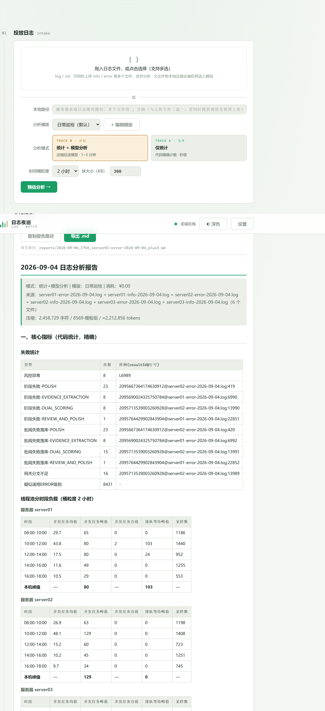
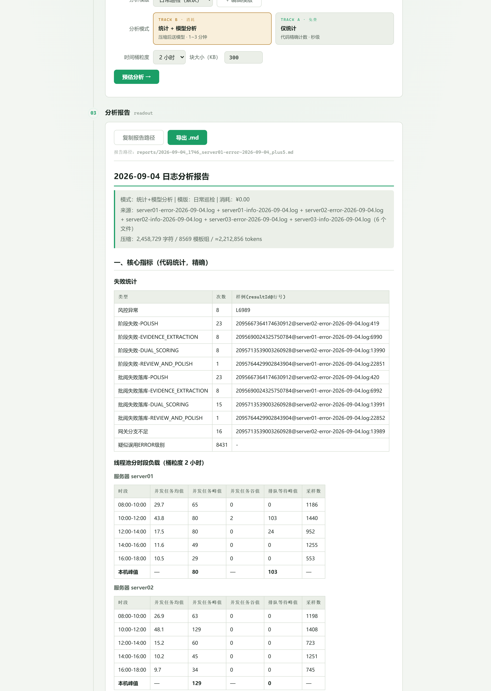
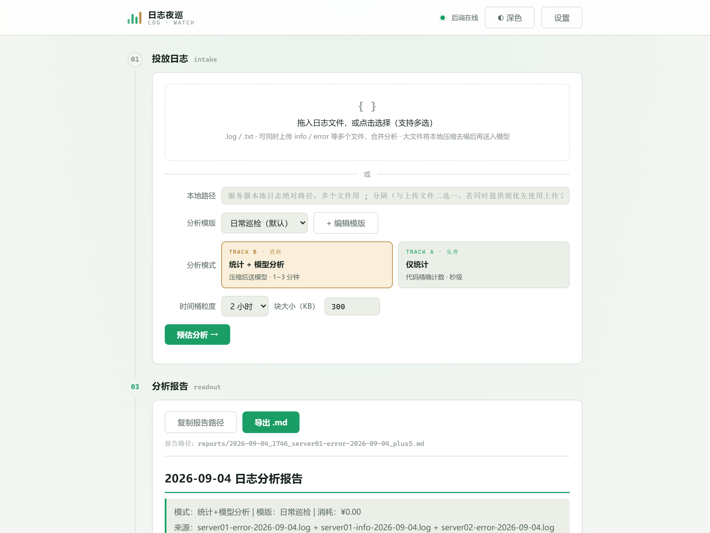

# composition-log-examine · 日志夜巡

本地 Web 工具：上传 Java logback 日志（支持多服务器 info/error 文件合并分析），**双轨分析**后产出可回看的 Markdown 报告。

- **轨道 A · 代码精确统计（秒级、零成本）**：失败事件统计（风控异常 / 阶段失败 / 批阅失败落库 / 网关分支不足）、线程池分时段负载（按服务器分组，含并发均值/峰值/谷值、排队等待、压力信号）、处理人数统计（按 resultId 去重）
- **轨道 B · 模型分析（可选）**：压缩去噪（实测 8MB → 137K 字符）→ 智能分块（块大小按压缩结果自动推荐，可手动调整）→ Map-Reduce 调用 OpenAI 兼容 API，按分析模版输出结论/异常明细/建议
- 内置历史档案、消耗台账、失败详情弹窗与定位 SQL 生成、深浅双主题

## 使用效果

**报告核心指标区**（失败统计 + 多服务器线程池负载 + 压力信号 + 处理人数）：



**模型分析章节**（按模版输出的结论与建议）：



**工具界面**（上传 / 预估 / 历史档案 / 消耗台账）：



## 快速开始

```powershell
pip install -r requirements.txt
copy config.example.json config.json   # 填入你的 API Key（仅统计模式可不填）
start.bat                               # 或: python main.py → http://127.0.0.1:8000
```

克隆后运行测试需自备样例日志（测试夹具含真实业务数据，不入库）：

```powershell
python -m pytest -q
```

## 目录结构

```
core/    parser 解析 / stats 统计 / compressor 压缩 / chunker 切块 / analyzer 模型分析
web/     单页前端（原生 HTML/JS，无构建）
docs/    设计文档 + 适配新项目日志指南
tests/   回归测试
```

适配其他项目的日志：参见 [docs/适配新项目日志指南.md](docs/适配新项目日志指南.md)。
