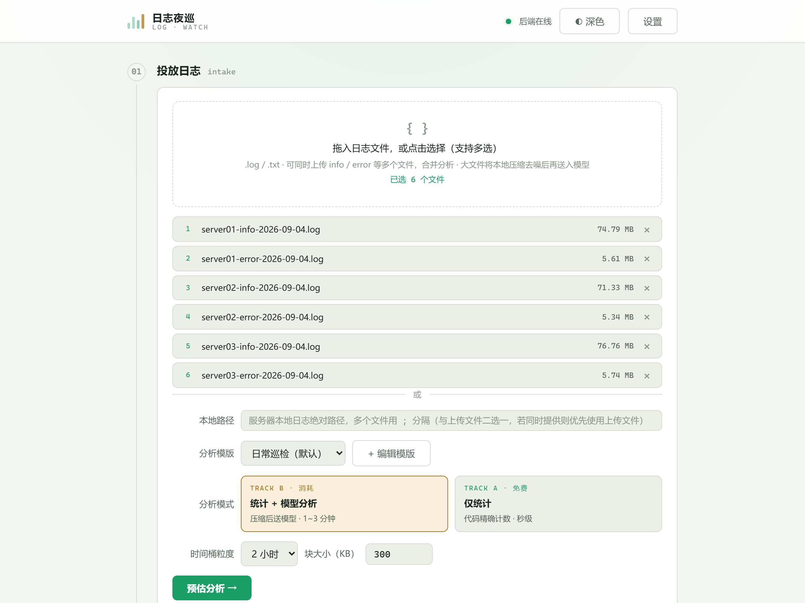
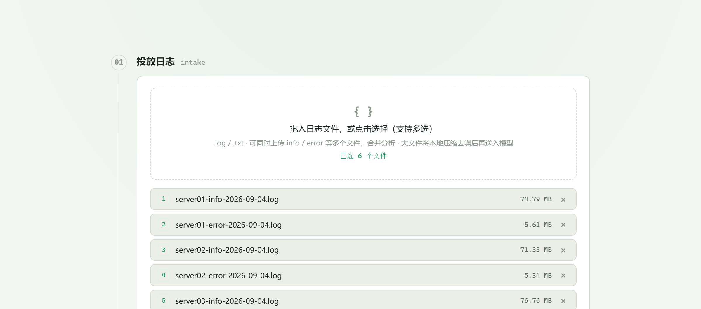
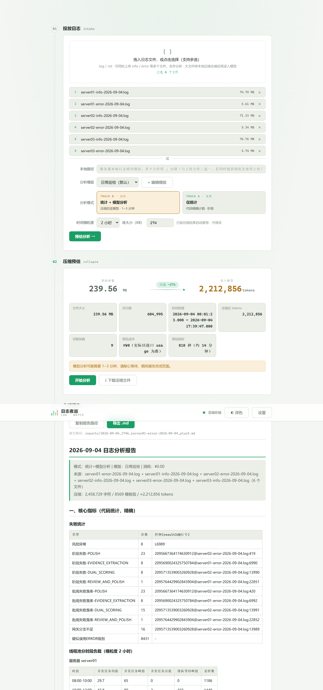
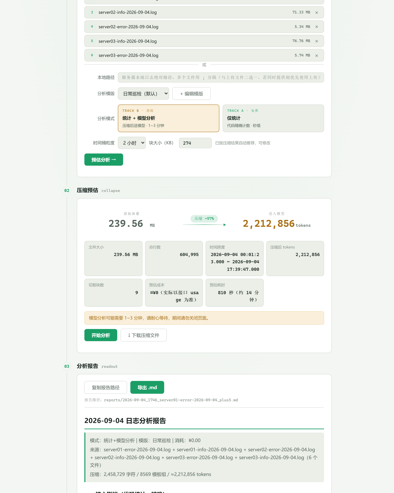
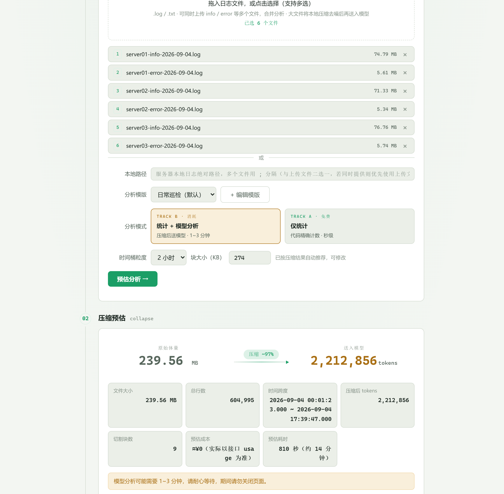

# composition-log-examine · 日志夜巡

本地 Web 工具：上传 Java logback 日志 → **双轨分析**（代码精确统计 + 可选模型分析）→ 产出可回看的 Markdown 报告。

针对作文批改服务（composition-ai）的日常巡检场景设计，支持多服务器 info/error 日志合并分析。

## 功能特性

**轨道 A · 代码精确统计**（秒级、零成本、数字 100% 来自代码提取）

- 失败事件统计：风控异常 / 阶段失败（按 stage 分组）/ 批阅失败落库 / 网关分支不足，均带 resultId 溯源
- 线程池分时段负载：按服务器分组（文件名聚类），含并发均值/峰值/谷值、排队等待、压力信号自动判定
- 处理人数统计：按「批改流水线启动」日志的 resultId 去重
- 例行日志计数、阶段耗时汇总

**轨道 B · 模型分析**（可选、按模版输出）

- 压缩去噪：模板归并 + 大载荷截断（实测 8MB → 137K 字符，压缩率 98%+）
- 智能分块：块大小按压缩结果自动推荐（300K 上限内均衡分块），可手动调整
- Map-Reduce 管线：分块并发分析 → 中间摘要归并 → 最终报告（结论/异常明细/建议）
- OpenAI 兼容 API（Kimi / DeepSeek / 智谱 / 火山方舟 / 自定义）

**平台能力**

- 多文件上传（info + error 分开传，自动按文件名聚类服务器）
- 历史档案 + 消耗台账（token / 费用 / 耗时）
- 失败详情弹窗 + 一键生成数据库定位 SQL（测试/正式环境切换）
- 深浅双主题（夜巡 / 晨巡）

## 使用演示

以某日 3 台服务器 6 个日志文件（info/error，共约 250MB）的真实巡检为例：

### 第 1 步 · 上传日志

拖拽或选择多个日志文件，支持 info / error 分批拖入；选择分析模式与模版，时间桶粒度可选 1/2/3 小时：



### 第 2 步 · 预估确认

点「预估分析」→ 秒级得到压缩效果、token 量、块数、预估成本与耗时。块大小已按压缩结果自动推荐（可修改）。确认无误后点「开始分析」：



### 第 3 步 · 查看报告

分析完成后自动渲染 Markdown 报告。核心指标区为代码精确统计——失败统计表、**按服务器分组的线程池负载表**（各机独立峰值 + 全局峰值）、压力信号高亮、处理人数统计：



模型分析章节按所选模版输出结论、异常明细与建议（失败根因定位、时段聚集与线程池关联判断等）：



### 第 4 步 · 历史回看

报告自动落盘 `reports/`，历史档案支持日期筛选与批量删除；消耗台账记录每次分析的模型调用、token 与费用：



## 快速开始

```powershell
pip install -r requirements.txt
copy config.example.json config.json   # 填入 API Key（仅统计模式可不填）
start.bat                               # 或: python main.py
# 打开 http://127.0.0.1:8000
```

克隆后运行测试需自备样例日志（测试夹具含真实业务数据，不入库）：

```powershell
python -m pytest -q
```

## 配置说明

`config.json`（由页面「设置」维护，或参照 `config.example.json`）：

| 字段 | 说明 | 默认 |
|---|---|---|
| base_url / api_key / model | OpenAI 兼容 API 配置 | - |
| concurrency | 模型调用并发数（Map 阶段限流） | 3 |
| max_chars | 分块大小上限（字符）；实际以预估推荐值为准 | 300000 |
| bucket_hours | 统计时间桶粒度（小时） | 2 |
| price_per_m | 计价单价（元/百万 tokens，可被模型价目表覆盖） | - |

## 目录结构

```
core/      parser 解析 / stats 统计 / compressor 压缩 / chunker 分块 / analyzer 模型分析 / report 报告
web/       单页前端（原生 HTML/JS，无构建）
templates/ 分析模版（页面可视化编辑）
docs/      设计文档 + 截图
tests/     回归测试
```

**适配其他项目的日志**：参见 [docs/适配新项目日志指南.md](docs/适配新项目日志指南.md)，按三层适配模型（解析 → 模版 → 统计口径）逐项调整。

## License

[MIT](LICENSE)
